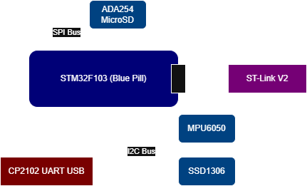

# STM32 Bare-Metal IMU Logger

  

<p align="center">
  
</p>

Bare-metal STM32F103 IMU data logger. Reads motion data from an MPU6050 at 100Hz, estimates roll/pitch via complementary filter, displays live telemetry on an SSD1306 OLED, and logs structured timestamped records to microSD. No HAL — register-level C throughout.

---

## Features

- Register-level drivers for I2C, SPI, USART, TIM2, and clock configuration — no HAL, no LL
- MPU6050 driver: raw accel/gyro acquisition, gyro bias calibration on startup, low-pass filtering
- Timer-driven fixed-rate 100Hz sampling via TIM2 interrupt
- Complementary filter for roll and pitch orientation estimation (98% gyro / 2% accel)
- Live measured sample rate computed from timer ticks
- SSD1306 OLED driver: live roll, pitch, temperature, and measured Hz display
- SD card driver: SDSC/SDHC detection, SPI-mode CMD sequence, block read/write with retry logic
- FatFS integration via custom diskio HAL — structured CSV logging to `log.csv`
- UART streaming at 115200 baud for live sensor data output
- Python analysis pipeline for CSV import and orientation visualization

---

## Hardware

<p align="center">
  
</p>

| Component | Interface | STM32F103 Pins |
|---|---|---|
| MPU6050 IMU | I2C1 | PB6 (SCL), PB7 (SDA) |
| SSD1306 OLED | I2C1 | PB6 (SCL), PB7 (SDA) |
| MicroSD (ADA254) | SPI1 | PA5 (SCK), PA6 (MISO), PA7 (MOSI), PA4 (CS) |
| CP2102 UART-USB | USART1 | PA9 (TX), PA10 (RX) |
| ST-Link V2 | SWD | SWDIO, SWCLK, GND, 3.3V |

---

## How It Works

TIM2 fires at 100Hz and sets a `sample_flag`. The main loop reads that flag, pulls raw accel and gyro data from the MPU6050 over I2C, applies a low-pass filter, and runs a complementary filter to fuse gyro integration with accelerometer-derived angle. Every 5th sample the formatted CSV record is written to UART and to the FatFS file. Every 50th sample the OLED refreshes and the file is flushed to SD. Gyro bias is calibrated at startup by averaging 1000 static samples.

---

## Quick Start

**Requirements:** arm-none-eabi-gcc, ST-Link, STM32CubeIDE or Makefile build

1. Clone the repo and open in STM32CubeIDE (or adapt the Makefile)
2. Format the SD card as FAT32 before first use
3. Build and flash via ST-Link
4. On power-up, hold the board still for ~1 second during gyro calibration, then motion data will begin logging
5. Eject the SD card and open `log.csv` to access logged data

---

## Data Format

`log.csv` columns (20Hz log rate, 100Hz sample rate):

```
timestamp, ax, ay, az, gx, gy, gz, roll, pitch, temp
```

| Column | Unit |
|---|---|
| timestamp | TIM2 ticks (10ms each) |
| ax, ay, az | g (filtered) |
| gx, gy, gz | deg/s (filtered, bias-corrected) |
| roll, pitch | degrees |
| temp | °C |

---

## Analysis

A Python script is included to import and plot the logged data:

```bash
pip install pandas matplotlib
python analyze.py
```

---

## Author

Rohaan Brar — embedded systems learning project, Purdue CompE.
